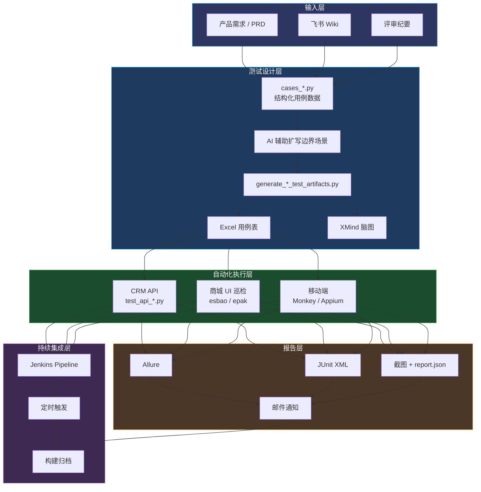
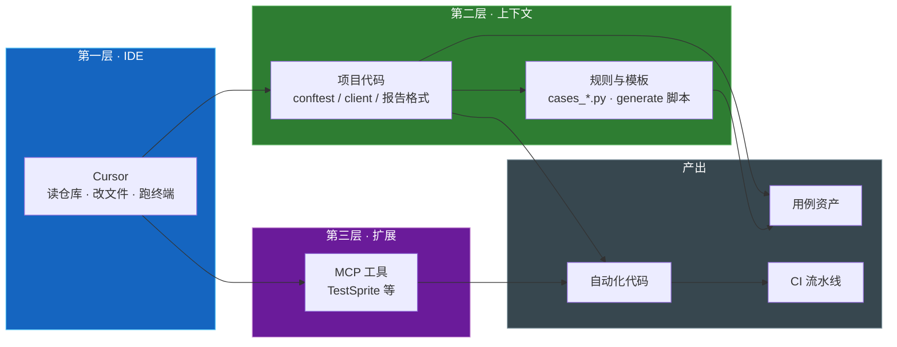
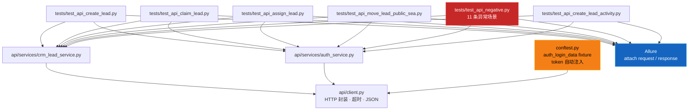
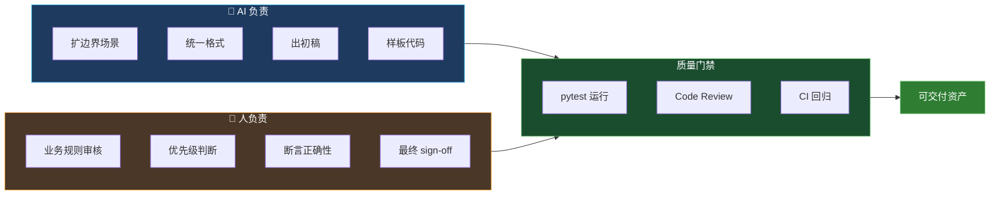
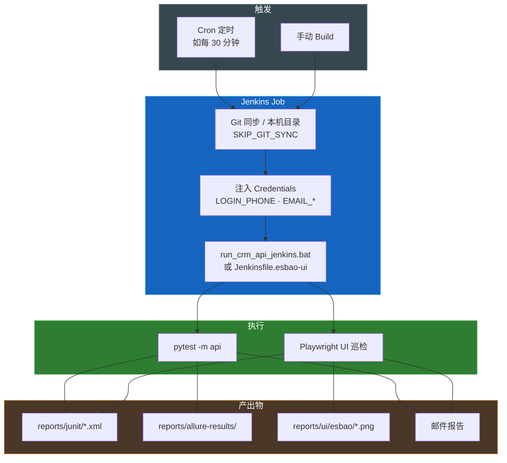
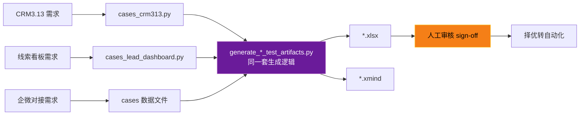
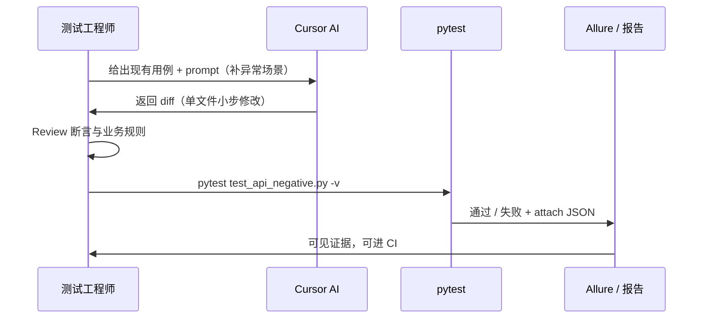

# 分享会架构图（Mermaid · 可截图进 PPT）

> **截图方法**  
> 1. 用 VS Code / Cursor 装 Mermaid 预览插件，打开本文件预览后截图  
> 2. 或打开 [Mermaid Live Editor](https://mermaid.live)，粘贴对应代码块导出 PNG/SVG  
> 3. 建议导出宽度 1920px，插入 PPT 第 5、9、10、12 页

---

## 图 1：总链路图（★ 建议放第 5 页）



**讲解话术（30 秒）：**  
从上往下：需求进来先结构化，AI 帮扩场景，脚本一键出 Excel 和脑图；能自动化的进 pytest；跑完出 Allure、截图、邮件；最后挂到 Jenkins 定时回归，变成团队资产。

---

## 图 2：工具栈三层图（建议放第 4 页）



---

## 图 3：CRM API 自动化分层（建议放第 10 页）



---

## 图 4：人机分工（建议放第 8 页）



---

## 图 5：Jenkins 回归流水线（建议放第 12 页）



---

## 图 6：用例生成复用模式（建议放第 16 页）



---

## 图 7：Demo 闭环（建议放 Demo 前或第 18 页）



---

## PPT 插图对照表

| PPT 页码 | 推荐插图 |
|----------|----------|
| 第 4 页 | 图 2 工具栈三层 |
| 第 5 页 | 图 1 总链路（主图） |
| 第 8 页 | 图 4 人机分工 |
| 第 10 页 | 图 3 API 分层 |
| 第 12 页 | 图 5 Jenkins 流水线 |
| 第 16 页 | 图 6 用例生成复用 |
| 第 18 页 | 图 7 Demo 闭环 |

---

## ASCII 备用图（无法渲染 Mermaid 时投影用）

### 总链路（纯文本版）

```
  需求/Wiki ──→ cases_*.py ──→ generate 脚本 ──→ Excel + XMind
                                                    │
                                                    ▼
                                           pytest 自动化
                                          (API / UI / 移动端)
                                                    │
                     ┌──────────────────────────────┼──────────────────────────────┐
                     ▼                              ▼                              ▼
                 Allure                        截图/JSON                        邮件
                     │                              │                              │
                     └──────────────────────────────┴──────────────────────────────┘
                                                    ▼
                                            Jenkins 定时回归
```
